# University Course Management System

A relational database management system implemented in MySQL to manage university departments, students, courses, instructors, and enrollments with comprehensive querying, reporting, and data manipulation operations.

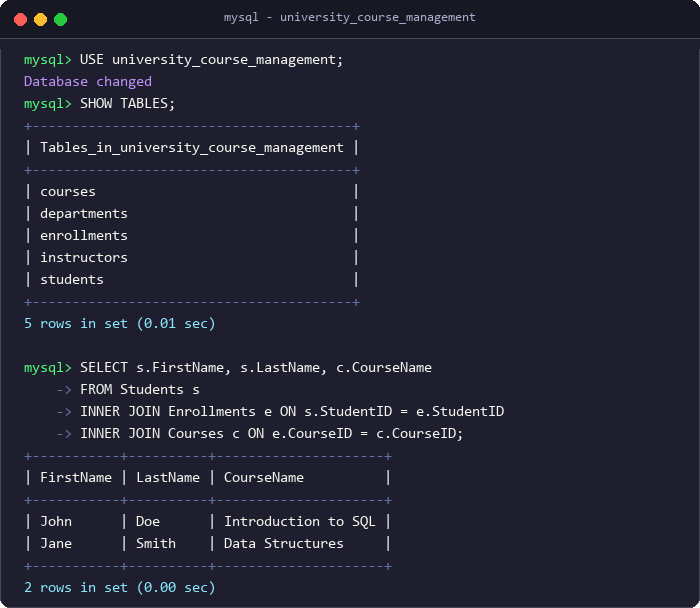

## Table of Contents

- [Overview](#overview)
- [Schema & Structure](#schema--structure)
- [Tech Stack & Requirements](#tech-stack--requirements)
- [Getting Started](#getting-started)
- [Features & Operations Covered](#features--operations-covered)
- [Sample Queries/Usage & Output](#sample-queriesusage--output)
- [Project Structure](#project-structure)
- [Author](#author)
- [License](#license)

---

## Overview

The **University Course Management System** is a relational database project designed to model academic administrative workflows in a higher education institution. It manages core university entities: academic departments, enrolled students, course catalogs, faculty instructors, and student course enrollments.

The project implements a complete MySQL database script (`university_course_management_full.sql`) containing:
- Complete Data Definition Language (DDL) specifications with primary and foreign key integrity constraints.
- Seed data initialization.
- Comprehensive Data Manipulation Language (DML) CRUD operations across all tables.
- Advanced querying techniques including inner/left joins, correlated subqueries, set intersections, aggregate functions with `HAVING` filters, MySQL date and string functions, analytic window functions, and conditional `CASE` expressions.

---

## Schema & Structure

The system is organized into five relational tables within the `university_course_management` database:

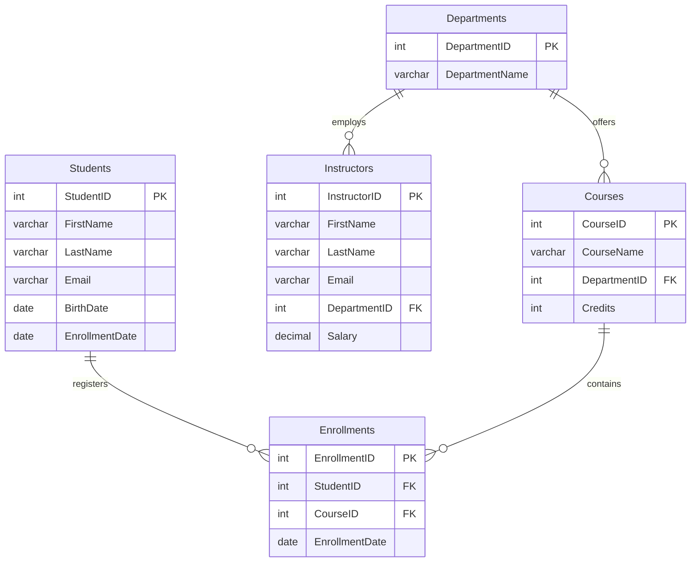

### Table Specifications

1. **`Departments`**
   - `DepartmentID` (`INT`, `PRIMARY KEY`): Unique identifier for each academic department.
   - `DepartmentName` (`VARCHAR(50)`): Name of the academic department (e.g., Computer Science, Mathematics).

2. **`Students`**
   - `StudentID` (`INT`, `PRIMARY KEY`): Unique identifier for each student.
   - `FirstName` (`VARCHAR(50)`): Student first name.
   - `LastName` (`VARCHAR(50)`): Student last name.
   - `Email` (`VARCHAR(100)`): Student email address.
   - `BirthDate` (`DATE`): Student birth date.
   - `EnrollmentDate` (`DATE`): Date the student originally matriculated at the university.

3. **`Courses`**
   - `CourseID` (`INT`, `PRIMARY KEY`): Unique identifier for each course.
   - `CourseName` (`VARCHAR(100)`): Full title of the course.
   - `DepartmentID` (`INT`): Foreign key referencing `Departments(DepartmentID)`.
   - `Credits` (`INT`): Number of academic credit hours assigned to the course.

4. **`Instructors`**
   - `InstructorID` (`INT`, `PRIMARY KEY`): Unique identifier for each instructor.
   - `FirstName` (`VARCHAR(50)`): Instructor first name.
   - `LastName` (`VARCHAR(50)`): Instructor last name.
   - `Email` (`VARCHAR(100)`): Official university email address.
   - `DepartmentID` (`INT`): Foreign key referencing `Departments(DepartmentID)`.
   - `Salary` (`DECIMAL(10, 2)`): Instructor annual salary.

5. **`Enrollments`**
   - `EnrollmentID` (`INT`, `PRIMARY KEY`): Unique identifier for each course enrollment record.
   - `StudentID` (`INT`): Foreign key referencing `Students(StudentID)`.
   - `CourseID` (`INT`): Foreign key referencing `Courses(CourseID)`.
   - `EnrollmentDate` (`DATE`): Date the student enrolled in the course.

---

## Tech Stack & Requirements

- **Database Engine**: MySQL Server 8.0+ (Required for window functions like `COUNT(*) OVER()`)
- **SQL Dialect**: MySQL 8.0 DDL / DML / Window Functions
- **Client Tools**: MySQL Command Line Client (`mysql.exe`), MySQL Workbench 8.0, or any standard SQL client

---

## Getting Started

### Prerequisites

Ensure MySQL Server 8.0 or higher is installed and running on your system.

### Execution via MySQL Command Line Client

1. Open a terminal or command prompt and log into your MySQL server:
   ```bash
   mysql -u root -p
   ```

2. Execute the entire SQL script:
   ```sql
   SOURCE university_course_management_full.sql;
   ```

   *Alternatively, run the script directly from your terminal:*
   ```bash
   mysql -u root -p < university_course_management_full.sql
   ```

3. Verify the database and tables:
   ```sql
   USE university_course_management;
   SHOW TABLES;
   ```

---

## Features & Operations Covered

The table below maps each required project task to its implementation in `university_course_management_full.sql`:

| Task # | Required Task Description | SQL Features & Syntax | Script Lines |
|:---|:---|:---|:---|
| **1** | Perform CRUD operations on all tables | `INSERT INTO`, `SELECT *`, `UPDATE ... SET`, `DELETE FROM` on all 5 tables | Lines 75–111 |
| **2** | Retrieve students who enrolled after 2022 | Date comparison filter: `WHERE EnrollmentDate > '2022-12-31'` | Lines 114–118 |
| **3** | Retrieve courses offered by the Mathematics department with a limit of 5 courses | `JOIN` (`Courses` + `Departments`) with `WHERE` filter and `LIMIT 5` | Lines 121–128 |
| **4** | Get the number of students enrolled in each course, filtering for courses with more than 5 students | `GROUP BY CourseID` with `COUNT(StudentID)` aggregate and `HAVING COUNT() > 5` | Lines 132–138 |
| **5** | Find students who are enrolled in both Introduction to SQL and Data Structures | Multiple subquery intersection: `WHERE StudentID IN (...) AND StudentID IN (...)` | Lines 141–155 |
| **6** | Find students who are either enrolled in Introduction to SQL or Data Structures | `INNER JOIN` with `WHERE CourseName IN (...)` and `DISTINCT` | Lines 158–167 |
| **7** | Calculate the average number of credits for all courses | Aggregate function: `AVG(Credits)` | Lines 170–173 |
| **8** | Find the maximum salary of instructors in the Computer Science department | `INNER JOIN` (`Instructors` + `Departments`) with `MAX(Salary)` | Lines 176–183 |
| **9** | Count the number of students enrolled in each department | Three-table join (`Departments`, `Courses`, `Enrollments`) with `GROUP BY` and `COUNT()` | Lines 187–194 |
| **10** | INNER JOIN: Retrieve students and their corresponding courses | Multi-table `INNER JOIN` (`Students` + `Enrollments` + `Courses`) | Lines 198–203 |
| **11** | LEFT JOIN: Retrieve all students and their corresponding courses, if any | Multi-table `LEFT JOIN` (`Students` + `Enrollments` + `Courses`) | Lines 207–213 |
| **12** | Subquery: Find students enrolled in courses that have more than 10 students | Nested subquery with `GROUP BY CourseID` and `HAVING COUNT() > 10` | Lines 216–230 |
| **13** | Extract the year from the EnrollmentDate of students | MySQL date function: `YEAR(EnrollmentDate)` | Lines 233–237 |
| **14** | Concatenate the instructor's first and last name | String function: `CONCAT(FirstName, ' ', LastName)` | Lines 240–243 |
| **15** | Calculate the running total of students enrolled in courses | Window function: `COUNT(*) OVER (ORDER BY EnrollmentDate)` | Lines 246–251 |
| **16** | Label students as 'Senior' or 'Junior' based on year of enrollment | Conditional expression: `CASE WHEN ... <= DATE_SUB(CURDATE(), INTERVAL 4 YEAR) THEN 'Senior' ELSE 'Junior' END` | Lines 254–264 |

---

## Sample Queries/Usage & Output

### 1. Perform CRUD Operations on All Tables

Demonstrates `INSERT`, `SELECT`, `UPDATE`, and `DELETE` across `Departments`, `Students`, `Courses`, `Instructors`, and `Enrollments`.

```sql
-- Departments CRUD example
INSERT INTO Departments (DepartmentID, DepartmentName) VALUES (3, 'Physics');
SELECT * FROM Departments;
UPDATE Departments SET DepartmentName = 'Applied Mathematics' WHERE DepartmentID = 2;
DELETE FROM Departments WHERE DepartmentID = 3;
```

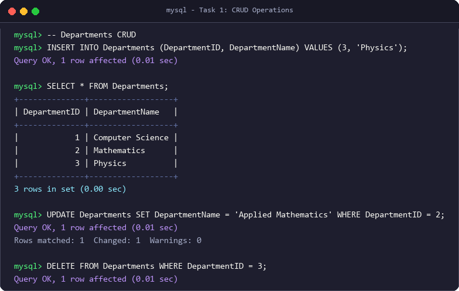

```text
+--------------+------------------+
| DepartmentID | DepartmentName   |
+--------------+------------------+
|            1 | Computer Science |
|            2 | Mathematics      |
|            3 | Physics          |
+--------------+------------------+
3 rows in set (0.00 sec)
```

---

### 2. Retrieve Students Who Enrolled After 2022

```sql
SELECT * FROM Students
WHERE EnrollmentDate > '2022-12-31';
```


```text
Empty set (0.00 sec)
```

---

### 3. Retrieve Courses Offered by the Mathematics Department (Limit 5)

```sql
SELECT c.*
FROM Courses c
JOIN Departments d ON c.DepartmentID = d.DepartmentID
WHERE d.DepartmentName = 'Mathematics'
LIMIT 5;
```

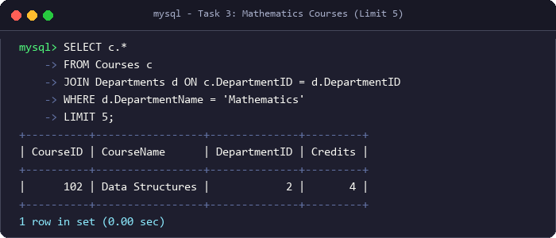

```text
+----------+-----------------+--------------+---------+
| CourseID | CourseName      | DepartmentID | Credits |
+----------+-----------------+--------------+---------+
|      102 | Data Structures |            2 |       4 |
+----------+-----------------+--------------+---------+
1 row in set (0.00 sec)
```

---

### 4. Course Enrollment Count (Filtered for > 5 Students)

```sql
SELECT CourseID, COUNT(StudentID) AS student_count
FROM Enrollments
GROUP BY CourseID
HAVING COUNT(StudentID) > 5;
```

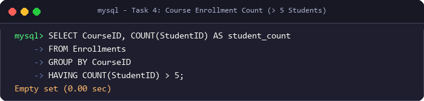

```text
Empty set (0.00 sec)
```

---

### 5. Students Enrolled in Both 'Introduction to SQL' and 'Data Structures'

```sql
SELECT s.*
FROM Students s
WHERE s.StudentID IN (
    SELECT e.StudentID FROM Enrollments e
    JOIN Courses c ON e.CourseID = c.CourseID
    WHERE c.CourseName = 'Introduction to SQL'
)
AND s.StudentID IN (
    SELECT e.StudentID FROM Enrollments e
    JOIN Courses c ON e.CourseID = c.CourseID
    WHERE c.CourseName = 'Data Structures'
);
```

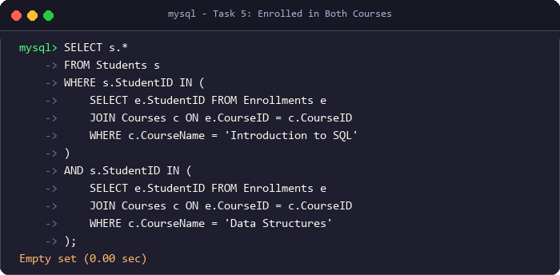

```text
Empty set (0.00 sec)
```

---

### 6. Students Enrolled in Either 'Introduction to SQL' or 'Data Structures'

```sql
SELECT DISTINCT s.*
FROM Students s
JOIN Enrollments e ON s.StudentID = e.StudentID
JOIN Courses c ON e.CourseID = c.CourseID
WHERE c.CourseName IN ('Introduction to SQL', 'Data Structures');
```

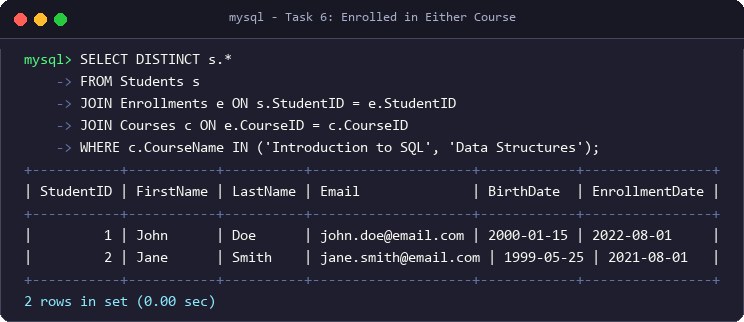

```text
+-----------+-----------+----------+--------------------+------------+----------------+
| StudentID | FirstName | LastName | Email              | BirthDate  | EnrollmentDate |
+-----------+-----------+----------+--------------------+------------+----------------+
|         1 | John      | Doe      | john.doe@email.com | 2000-01-15 | 2022-08-01     |
|         2 | Jane      | Smith    | jane.smith@email.com | 1999-05-25 | 2021-08-01   |
+-----------+-----------+----------+--------------------+------------+----------------+
2 rows in set (0.00 sec)
```

---

### 7. Average Number of Credits for All Courses

```sql
SELECT AVG(Credits) AS avg_credits FROM Courses;
```

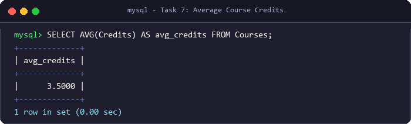

```text
+-------------+
| avg_credits |
+-------------+
|      3.5000 |
+-------------+
1 row in set (0.00 sec)
```

---

### 8. Maximum Salary of Instructors in Computer Science Department

```sql
SELECT MAX(i.Salary) AS max_salary
FROM Instructors i
JOIN Departments d ON i.DepartmentID = d.DepartmentID
WHERE d.DepartmentName = 'Computer Science';
```

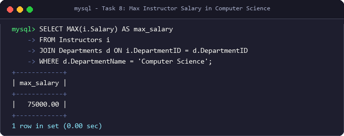

```text
+------------+
| max_salary |
+------------+
|   75000.00 |
+------------+
1 row in set (0.00 sec)
```

---

### 9. Count of Students Enrolled in Each Department

```sql
SELECT d.DepartmentName, COUNT(e.StudentID) AS student_count
FROM Departments d
JOIN Courses c ON d.DepartmentID = c.DepartmentID
JOIN Enrollments e ON c.CourseID = e.CourseID
GROUP BY d.DepartmentName;
```

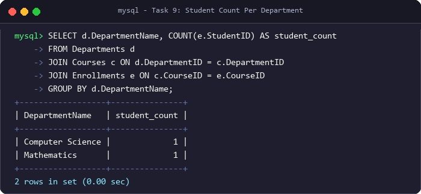

```text
+------------------+---------------+
| DepartmentName   | student_count |
+------------------+---------------+
| Computer Science |             1 |
| Mathematics      |             1 |
+------------------+---------------+
2 rows in set (0.00 sec)
```

---

### 10. INNER JOIN: Retrieve Students and Their Corresponding Courses

```sql
SELECT s.FirstName, s.LastName, c.CourseName
FROM Students s
INNER JOIN Enrollments e ON s.StudentID = e.StudentID
INNER JOIN Courses c ON e.CourseID = c.CourseID;
```

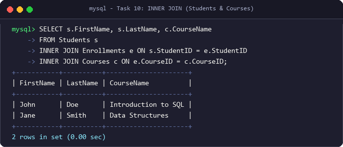

```text
+-----------+----------+---------------------+
| FirstName | LastName | CourseName          |
+-----------+----------+---------------------+
| John      | Doe      | Introduction to SQL |
| Jane      | Smith    | Data Structures     |
+-----------+----------+---------------------+
2 rows in set (0.00 sec)
```

---

### 11. LEFT JOIN: Retrieve All Students and Their Corresponding Courses

```sql
SELECT s.FirstName, s.LastName, c.CourseName
FROM Students s
LEFT JOIN Enrollments e ON s.StudentID = e.StudentID
LEFT JOIN Courses c ON e.CourseID = c.CourseID;
```

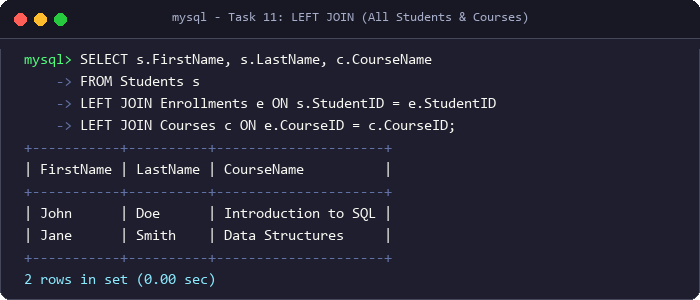

```text
+-----------+----------+---------------------+
| FirstName | LastName | CourseName          |
+-----------+----------+---------------------+
| John      | Doe      | Introduction to SQL |
| Jane      | Smith    | Data Structures     |
+-----------+----------+---------------------+
2 rows in set (0.00 sec)
```

---

### 12. Subquery: Students Enrolled in Courses with More Than 10 Students

```sql
SELECT *
FROM Students
WHERE StudentID IN (
    SELECT StudentID FROM Enrollments
    WHERE CourseID IN (
        SELECT CourseID FROM Enrollments
        GROUP BY CourseID
        HAVING COUNT(StudentID) > 10
    )
);
```

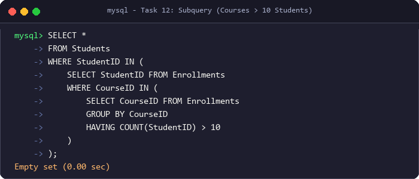

```text
Empty set (0.00 sec)
```

---

### 13. Extract Year from Student EnrollmentDate

```sql
SELECT StudentID, FirstName, LastName, YEAR(EnrollmentDate) AS EnrollmentYear
FROM Students;
```

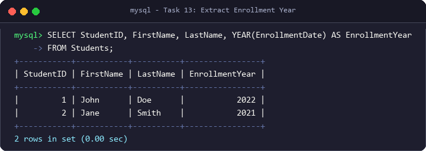

```text
+-----------+-----------+----------+----------------+
| StudentID | FirstName | LastName | EnrollmentYear |
+-----------+-----------+----------+----------------+
|         1 | John      | Doe      |           2022 |
|         2 | Jane      | Smith    |           2021 |
+-----------+-----------+----------+----------------+
2 rows in set (0.00 sec)
```

---

### 14. Concatenate Instructor First and Last Name

```sql
SELECT InstructorID, CONCAT(FirstName, ' ', LastName) AS FullName
FROM Instructors;
```

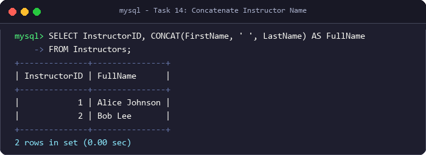

```text
+--------------+---------------+
| InstructorID | FullName      |
+--------------+---------------+
|            1 | Alice Johnson |
|            2 | Bob Lee       |
+--------------+---------------+
2 rows in set (0.00 sec)
```

---

### 15. Running Total of Students Enrolled in Courses

```sql
SELECT EnrollmentID, StudentID, CourseID, EnrollmentDate,
    COUNT(*) OVER (ORDER BY EnrollmentDate) AS running_total_students
FROM Enrollments;
```

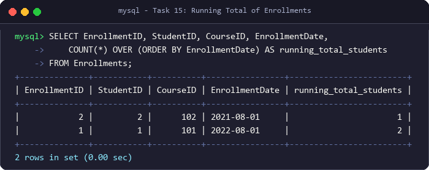

```text
+--------------+-----------+----------+----------------+------------------------+
| EnrollmentID | StudentID | CourseID | EnrollmentDate | running_total_students |
+--------------+-----------+----------+----------------+------------------------+
|            2 |         2 |      102 | 2021-08-01     |                      1 |
|            1 |         1 |      101 | 2022-08-01     |                      2 |
+--------------+-----------+----------+----------------+------------------------+
2 rows in set (0.00 sec)
```

---

### 16. Student Seniority Classification (Senior vs. Junior)

```sql
SELECT StudentID, FirstName, LastName, EnrollmentDate,
    CASE
        WHEN EnrollmentDate <= DATE_SUB(CURDATE(), INTERVAL 4 YEAR) THEN 'Senior'
        ELSE 'Junior'
    END AS StudentLabel
FROM Students;
```

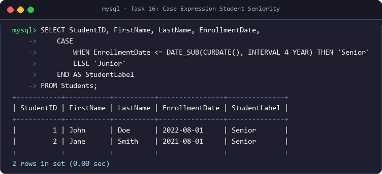

```text
+-----------+-----------+----------+----------------+--------------+
| StudentID | FirstName | LastName | EnrollmentDate | StudentLabel |
+-----------+-----------+----------+----------------+--------------+
|         1 | John      | Doe      | 2022-08-01     | Senior       |
|         2 | Jane      | Smith    | 2021-08-01     | Senior       |
+-----------+-----------+----------+----------------+--------------+
2 rows in set (0.00 sec)
```

---

## Project Structure

```
university-course-management/
├── screenshots/
│   ├── sample_output_preview.png
│   ├── 01_crud_operations.png
│   ├── 02_students_enrolled_after_2022.png
│   ├── 03_math_courses_limit_5.png
│   ├── 04_courses_over_5_students.png
│   ├── 05_enrolled_both_courses.png
│   ├── 06_enrolled_either_course.png
│   ├── 07_avg_course_credits.png
│   ├── 08_max_salary_cs.png
│   ├── 09_students_per_department.png
│   ├── 10_inner_join_students_courses.png
│   ├── 11_left_join_students_courses.png
│   ├── 12_subquery_large_courses.png
│   ├── 13_extract_enrollment_year.png
│   ├── 14_concat_instructor_name.png
│   ├── 15_running_total_enrollments.png
│   └── 16_case_student_seniority.png
├── university_course_management_full.sql
└── README.md
```

---

## Author

- **rudhiyansh** - [GitHub Profile](https://github.com/rudhiyansh)

---

## License

This project is licensed under the MIT License - see the [LICENSE](LICENSE) file for details.
